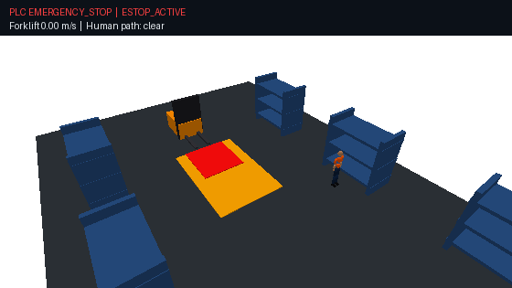

# Autonomous Forklift Safety Simulation

## PLC

A PLC (Programmable Logic Controller) is an industrial computer used to control
machines. Here, OpenPLC runs the IEC 61131-3 Structured Text safety logic and
decides when the forklift may drive, slow down, or stop.

## Pedestrian crossing



## PLC fault response


## Run

```bash
uv sync --extra sim
uv run forklift-sim --plc emulated --scenario demonstration
```

Controls: `R` reset, `1` warning-field walk, `2` protective-field walk,
`E` E-stop, `S` scanner fault, `D` drive fault, `C` communication loss,
`Space` pause, `Q` quit.

The simulator sends scanner, E-stop, drive, and watchdog inputs over Modbus TCP.
The PLC returns `DriveEnable`, `SafeStopRequest`, `SpeedLimit`, `SafetyState`, and
`FaultCode`. The forklift moves only when the PLC permits it.

## OpenPLC

Upload [`plc/openplc/forklift_safety.st`](plc/openplc/forklift_safety.st), start
OpenPLC's Modbus server, then run:

```bash
uv run forklift-sim --plc external --host 127.0.0.1 --port 502
```
